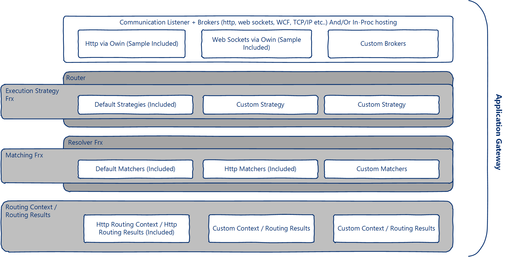

# Router #
Router is a building block that allows you to route requests between two application endpoints. The router is designed to work in-proc or behind a communication listener/broker. It is also designed to work in microservices based applications. Such as those hosted by Mesos or Azure Service Fabric. It is also designed to be used in SaaS scenarios where SaaS solution is based on microservices architecture. Along with your process/communication broker it comprises an application gateway.

# Usage Context #
1. Context based routing such as based on Http headers, host address, path, time of day, combination of conditions or custom.
2. Complex routing based on external factors such as matching address based on user identity. For example, matching users/tenants (SaaS scenarios. Sample scenario is provided in /servicefabric directory ). Addresses can be statically defined or dynamically resolved from a backend system.
3. Apply complex inflight call modification logic such as replacing payload body, modifying headers (in case of http), changing path or others.   
4. Apply call routing logic such as
  * Scatter/Gather - call routed to multiple backend hosts and aggregated response.
  * Fastest route - call routed to multiple backend hosts, fastest responding host wins.
  * Round/Robin (R/R) - load balancing between backend hosts.
5. Apply call execution logic such as retry, retry with back-off, fail to a different host, log. Execution logic can be chained and applied in sequence.
6. Protocol Transition (aka protocol bridges). For example, routing from Web Sockets to Http API *test project contains 2 samples on this*
7. Version Management. For example, route some clients to older versions of the API deployed on the backend, while other clients are routed to newer versions. Also used for A/B testing.

>The testing project (in the source code) contains samples on how to use the above.

 Because application gateway are meant to process all request, You can use it to do central user Authentication/Authorization at the entry point. Then perform trusted subsystem Authentication/Authorization between the gateway and the backend.

# Overview #



> Everything in the framework is either replaceable or customizable (except for the router which supports only customization).

**From top to bottom, the idea is:**
* The hosting process (which might include a communication listener) will host one or many router instances.
* **The Router** uses a resolver to perform a resolve on calls. In addition to maintaining telemetry.
* The resolver itself uses the **Matching Framework** (discussed in [In-Depth](./docs/in-depth.md) section). Currently the resolve operation takes < 0.01 ms and most of the times it falls under 0.001 ms. This was measured on Intel i7 quad core machine.
* The **Matching Framework** is a stateless in memory tree of *matchers* that are executed in sequence thereby allowing request validation, request modification, in addition to building the **Routing Context**.
* **Routing Context** represents a repeatable execution context. The router then executes the context returning to caller **Routing Results**. Router uses **Execution Strategy** to handle errors, perform retries and similar.
* The resolver instance is presented to the matching framework and routing context to allow them to perform in-between-routing-calls caching. Such as, caching final results, caching results of long calculations (for example it is used by the base **Routing Context** to maintain a reference to last host used in a load balancing set).  
* **Execution Strategy Framework** is a framework that is used by the router to handle errors. The framework consists of a set of execution strategies. They are represented as an in memory stateless linked list. Router executes a strategy and then moves to the next in case of errors (more on this in the [In-Depth](./docs/in-depth.md) section).         

# How to Use #
```C#
// The test project contains additional examples with more complex routing logic.  
// At minimum you need router, resolver, and one or more matchers
var resolver = new HttpRouteResolver(); // Included in the repo

/*
 If host address matches xxx://xxx.bing.xxx then route to  www.microsoft.com
 as Http Get
 */
var headMatcher = new HttpSetMethodMatcher(HttpMethod.Get);
headMatcher.Chain(new SetAddressListMatcher("www.microsoft.com"),
                  new HostAddressMatcher("www.bing.com", StringMatchType.UriHostandPortMatch));

// Resolver sits on top of multiple matching trees (ordered)
await resolver.AddMatcherAsync(headMatcher, 0);

var router = new HttpRouter(resolver); //Included in the package
// By not having any execution strategies assigned to the router, router will not retry.
// Check the test project for samples on execution strategy.

// **** in other places of your application                              
var results = await router.RouteAsync("http://www.bing.com");
//or this will also will work.
var results = await router.RouteAsync("bing");
//or you can additionally pass context Dictionary<string,object> in addition to stream (body)
```
# Repo Src Content #
1. **RouterLib**: Base routing, matching, resolving and strategy handling logic. The library has no reference to any external dependency (and no .NET assemblies except core ones) and is designed to work with CoreClr on Linux.
2. **HttpRouterLib**: Extends RouterLib to support Http routing.
3. **RouterLib.Owin**: Broker as Owin Owin pipeline stage.
4. **Router.Tests**: Testing and sample project for all of the above.
5. **ServiceFabric Directory**: Contains a microservices SaaS scenario based on Azure Service Fabric.

# Notes On HttpRouter Performance #
The Http Router has been improved with the following:
1. HttpClient instances are cached by host. (note xxx.host.com != yyy.host.com). Clients are never released.
2. HttpClient by default employs a basic connection pool.
3. By default each HttpClient instance maintain max-of 2 connection to host (Default .NET limits). HttpClient respects ServicePointManager class. So make sure to set ServicePointManager.DefaultConnectionLimit for the entire process for your production system to fan out connections from router to backend hosts.
   

# Next Steps #
* [In-Depth](./docs/in-depth.md) Further discussion on how matching & execution strategy frameworks are working.
* [Microservices SaaS scenario (Azure Service Fabric)](./docs/service-fabric-router.md)
