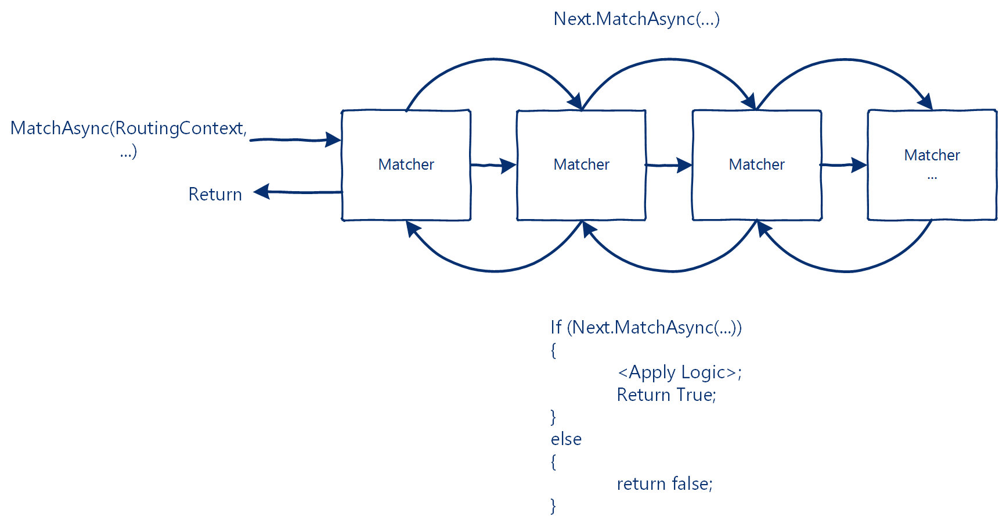
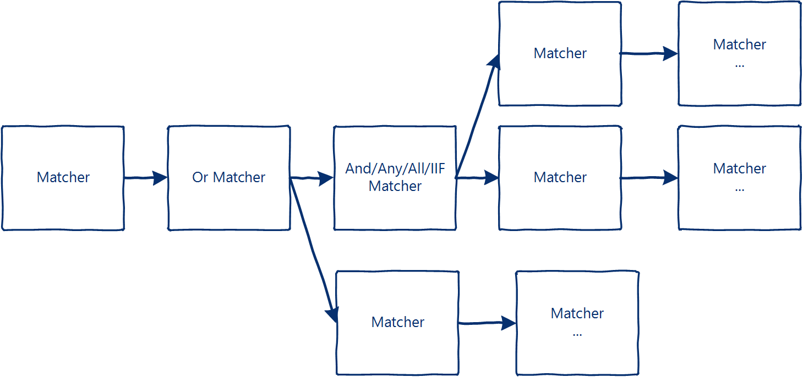
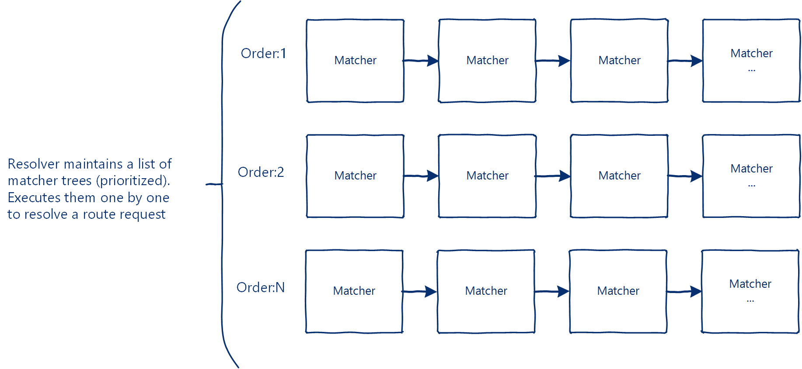
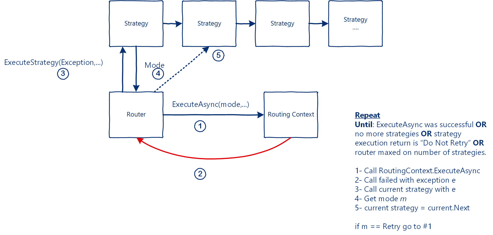

# In-Depth #
This section provides further details on how matching and strategy execution frameworks work.

# Matching Framework #
Matching framework is an in memory tree (represented as linked list) that executes backwards.
```C#
// for example:
var headMatcher = new HttpSetMethodMatcher(HttpMethod.Get);
headMatcher.Chain(new SetAddressListMatcher("www.microsoft.com"),
                  new HostAddressMatcher("www.bing.com", StringMatchType.UriHostandPortMatch));
// will execute HostAddressMatcher, then SetAddressListMatcher then HttpSetMethodMatcher
```



### Sequence of Events ###
Each matching component returns a boolean that represents success or failure. That means if next.MatchAsync(..) returned false then current matching component should return false (and it should not perform any matching logic).

Matchers must not maintain any internal state in-between-calls and must work in high concurrency multi-threaded environment. Any in-between-calls state should be maintained by the resolver. Each matching tree maintains a unique tree Id (set by the underlying framework). This allows you to cache based on a tree id. For example you might have a single component that manages addresses to different sets of backends hosts. The same componet can exist in 2 different trees and caching will work as expected.  

### Each matching component gets: ###
1. A reference to resolver have access to state in-between-calls if needed.
2. Reference to Routing Context to perform any logic that is needed (for example setting http method).
3. A reference to the original context (context passed to the original routing call).
4. A reference to the original body (body passed to the original routing call).

Because the framework includes matchers such as:
* And: Matches 2 operands using logical "And"
* Or: Matches 2 operands using logical "Or"
* All: Matches multiple operands using logical "And"
* Any: Matches multiple operands using logical "Or"
* IIF: Matches using an inline if statement

The actual matching in memory representation will look similar to:   



The above multi-purpose logical representation allows you to execute any matching logic needed, irrespective of how complex it is.

The resolver default implementation maintains a list of matching trees (in priority order). It will attempt to resolve using each tree until it finds a match (matcher returned true).  



# Execution Strategy Framework #
The router uses Execution Strategy Framework to handle errors (applying logic such as retry, changing routing, etc.). The Execution Strategy Framework itself is a linked list of strategies. The router executes them one by one in response to execution errors. Each strategy returns a "Mode" which instructs the router if it should attempt a retry. The mode itself is passed to the routing context.


